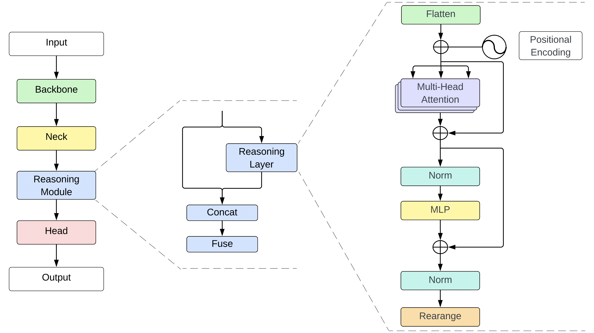

# IR Reasoner: Real-time Infrared Object Detection by Visual Reasoning

<p align="center">
  
</p>

## Performance 

FLIR ADAS

| Model | Test Size | FPS | AP<sup>test</sup> | AP<sub>50</sub><sup>test</sup> | AP<sub>75</sub><sup>test</sup> |
| :-- | :-: | :-: | :-: | :-: | :-: |
| [**YOLOv4-P6**](https://drive.google.com/drive/folders/1Z_08lbJ9XyYzKs-VH6v34OsehIcynOvO?usp=share_link) | 1280 | 25.0  | 26.3% | 40.4% | 28.2% |
| [**YOLOv4-P6-Reasoner**](https://drive.google.com/drive/folders/1Z_08lbJ9XyYzKs-VH6v34OsehIcynOvO?usp=share_link) | 1280 | 20.6  | **29.1%** | **44.9%** | **31.0%** |
|  |  |  |  |  |  |  |
| [**YOLOR-P6**](https://drive.google.com/drive/folders/1Z_08lbJ9XyYzKs-VH6v34OsehIcynOvO?usp=share_link) | 1280 | 33.7  | 36.4% | 53.1% | 39.9% |
| [**YOLOR-P6-Reasoner**](https://drive.google.com/drive/folders/1Z_08lbJ9XyYzKs-VH6v34OsehIcynOvO?usp=share_link) | 1280 | 28.1  | **39.4%** | **57.5%** | **44.2%** |
|  |  |  |  |  |  |  |
| [**YOLOv7-W6**](https://drive.google.com/drive/folders/1Z_08lbJ9XyYzKs-VH6v34OsehIcynOvO?usp=share_link) | 1280 | 44.1  | 39.5% | 57.5% | 44.0% |
| [**YOLOv7-W6-Reasoner**](https://drive.google.com/drive/folders/1Z_08lbJ9XyYzKs-VH6v34OsehIcynOvO?usp=share_link) | 1280 | 32.7  | **40.5%** | **58.5%** | **44.8%** |

## Citation

```bibtex
@InProceedings{IR-Reasoner,
    author    = {Gundogan, Meryem Mine and Aksoy, Tolga and Temizel, Alptekin and Halici, Ugur},
    title     = {IR Reasoner: Real-time Infrared Object Detection by Visual Reasoning},
    booktitle = {Proceedings of the IEEE/CVF Conference on Computer Vision and Pattern Recognition (CVPR) Workshops},
    month     = {June},
    year      = {2023},
    pages     = {-}
}
```

## Acknowledgements

<details><summary> <b>Expand</b> </summary>

* [https://github.com/WongKinYiu/ScaledYOLOv4](https://github.com/WongKinYiu/ScaledYOLOv4)
* [https://github.com/WongKinYiu/yolor](https://github.com/WongKinYiu/yolor)
* [https://github.com/WongKinYiu/yolov7](https://github.com/WongKinYiu/yolov7)
* [https://github.com/jacobgil/pytorch-grad-cam](https://github.com/jacobgil/pytorch-grad-cam)

</details>